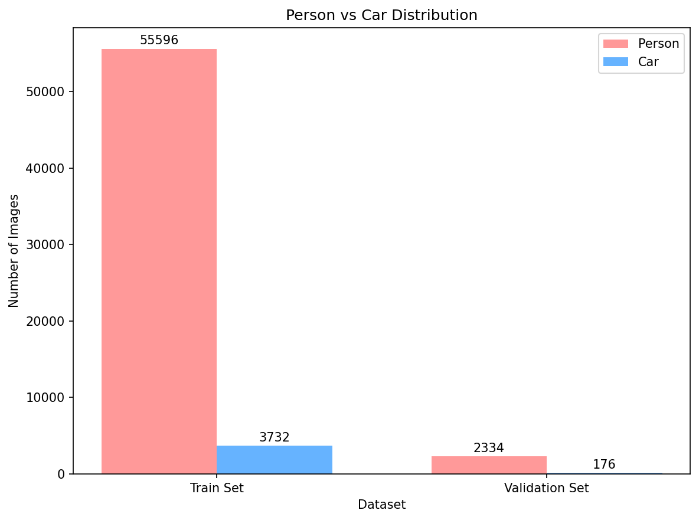

# COCO Person-Car Dataset Analysis Report

**Generated on:** 2026-01-27 00:10:10

数据样本展示

    <em>图2：数据集中包含人物和车辆的图像样本示例</em> 

## Dataset Statistics

### Image Counts
| Dataset | Total Images | Person Images | Car Images |
|---------|--------------|---------------|------------|
| **Train Set** | 59,328 | 55,596 | 3,732 |
| **Validation Set** | 2,510 | 2,334 | 176 |
| **Total** | 61,838 | 57,930 | 3,908 |

### Percentage Distribution
- **Train Set:** Person 93.7% | Car 6.3%
- **Validation Set:** Person 93.0% | Car 7.0%
- **Overall:** Person 93.7% | Car 6.3%

    <em>图1：训练集与验证集的数量对比）</em> 

##  Dataset Information

### File Details
- **Train CSV:** `coco_person_car_train_local.csv` (59328 records)
- **Validation CSV:** `coco_person_car_val_local.csv` (2510 records)
- **Images stored locally in:**
  - `coco/images/person_car_train2017/`
  - `coco/images/person_car_val2017/`
